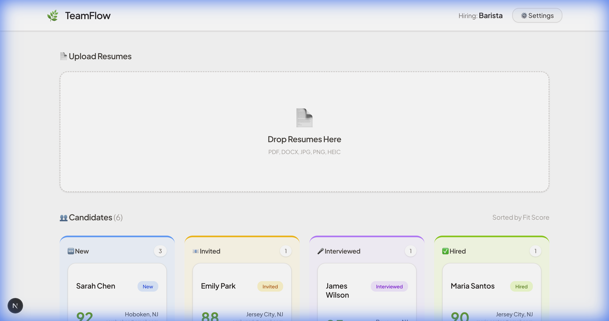
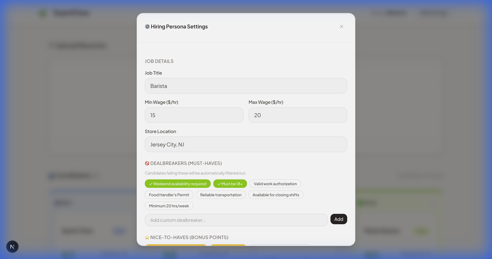
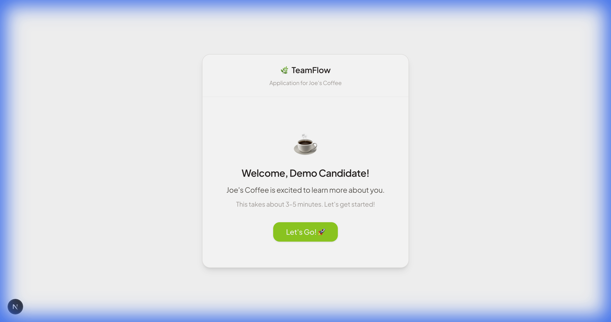
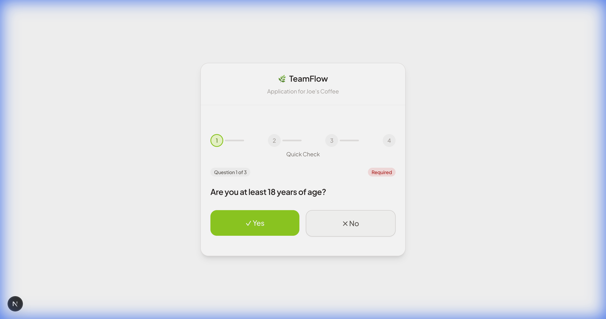
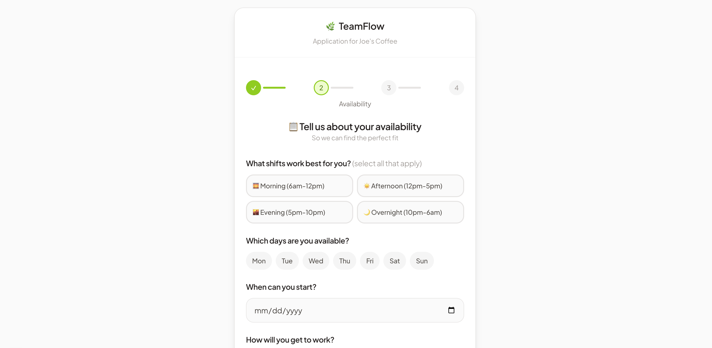
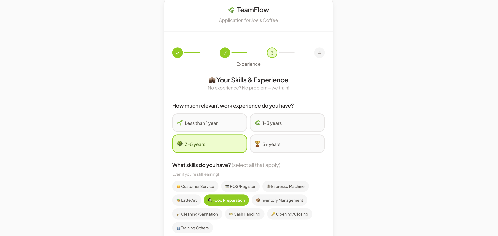

# 🌿 TeamFlow

**AI-Powered Hiring for Hourly Workers**

TeamFlow transforms the hourly hiring process with AI-powered resume parsing, intelligent candidate scoring, and a frictionless application experience. Built for busy hiring managers who need to make fast, informed decisions.

[](https://nextjs.org/)
[](https://ai.google.dev/)
[](https://www.typescriptlang.org/)
[](https://tailwindcss.com/)

---

## 🎯 The Problem

Hiring hourly workers is broken:
- **Managers are buried** in unstructured resumes
- **Candidates drop off** because applications are too long
- **No intelligent filtering** — just gut feelings
- **Manual screening** wastes hours every week

## 💡 The Solution

TeamFlow uses AI to solve this:

| Feature | How It Helps |
|---------|-------------|
| 🧠 **Smart Resume Parsing** | Drop a PDF, get structured data + fit score in seconds |
| 📊 **AI Fit Scoring** | Gemini 1.5 Flash analyzes match to job requirements |
| 📱 **Magic Link Invites** | One-click candidate invites via SMS — no login needed |
| 📋 **Rich Candidate Profiles** | Availability, skills, motivation — all in one place |
| 🎯 **Hiring Personas** | Define dealbreakers once, auto-filter forever |

---

## 📸 Screenshots

### Manager Experience

#### Dashboard — Kanban Board
Candidates organized by status with AI-generated fit scores. Drag-and-drop to move through the pipeline.



#### Hiring Persona Settings
Define job requirements, dealbreakers, and nice-to-haves. The AI uses this to score every candidate.



---

### Candidate Experience

#### Welcome Screen
Candidates receive a magic link (SMS/QR code) — no account needed. Personalized with the store's name.



#### Knockout Questions
Quick yes/no questions filter for dealbreakers (age, work authorization, availability).



#### Availability & Profile
Candidates share their preferred shifts, transportation, and contact preferences.



#### Skills Self-Assessment
Experience level, relevant skills, certifications, and languages — all collected seamlessly.



---

## 🏗️ Architecture

```
┌─────────────────────────────────────────────────────────────┐
│                      NEXT.JS FRONTEND                       │
│  ┌─────────────┐  ┌─────────────┐  ┌─────────────────────┐  │
│  │  Drop Zone  │  │ Kanban Board│  │  Candidate Portal   │  │
│  │ (Resume)    │  │ (Manager)   │  │  (Magic Link)       │  │
│  └──────┬──────┘  └──────┬──────┘  └──────────┬──────────┘  │
└─────────┼────────────────┼───────────────────┼──────────────┘
          │                │                   │
          ▼                ▼                   ▼
┌─────────────────────────────────────────────────────────────┐
│                      API ROUTES                              │
│  /api/parser (PDF→JSON)  │  /api/invite (Magic Links)       │
└─────────────────────────────────────────────────────────────┘
          │
          ▼
┌─────────────────────────────────────────────────────────────┐
│                   GEMINI 1.5 FLASH                          │
│  • Resume extraction   • Fit scoring   • Skill matching    │
└─────────────────────────────────────────────────────────────┘
```

---

## 🚀 Quick Start

### Prerequisites
- Node.js 18+
- Google AI API Key ([Get one free](https://aistudio.google.com/apikey))

### Installation

```bash
# Clone the repo
git clone https://github.com/rubiatExe/TeamFlow.git
cd TeamFlow

# Install dependencies
npm install

# Set up environment variables
cp .env.example .env.local
# Add your GOOGLE_AI_API_KEY

# Run the dev server
npm run dev
```

Open [http://localhost:3000](http://localhost:3000) — you're ready to hire!

### Test the Candidate Portal
Visit [http://localhost:3000/apply?token=test](http://localhost:3000/apply?token=test) to see the candidate experience.

---

## 🛠️ Tech Stack

| Layer | Technology |
|-------|------------|
| **Frontend** | Next.js 15 (App Router), React 19, Tailwind CSS 4 |
| **AI/ML** | Google Gemini 1.5 Flash |
| **UI Components** | shadcn/ui, Lucide Icons |
| **Database** | Supabase (PostgreSQL) + pgvector |
| **SMS** | Twilio (for magic links) |
| **Design** | Scandinavian Warmth design system |


---

## 🔮 Roadmap

- [x] Resume parsing with Gemini
- [x] AI fit scoring
- [x] Kanban candidate management
- [x] Magic link invites
- [x] Multi-step candidate portal
- [ ] Calendar integration for scheduling
- [ ] Square integration for merchant data
- [ ] Video/audio "Vibe Check" recording
- [ ] Bulk SMS campaigns

---

## 📄 License

MIT © 2024

---

