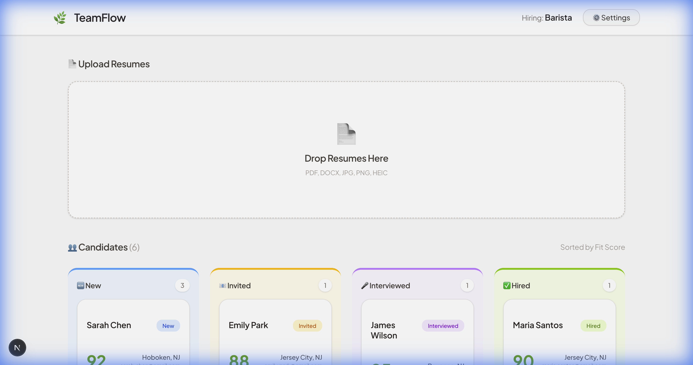
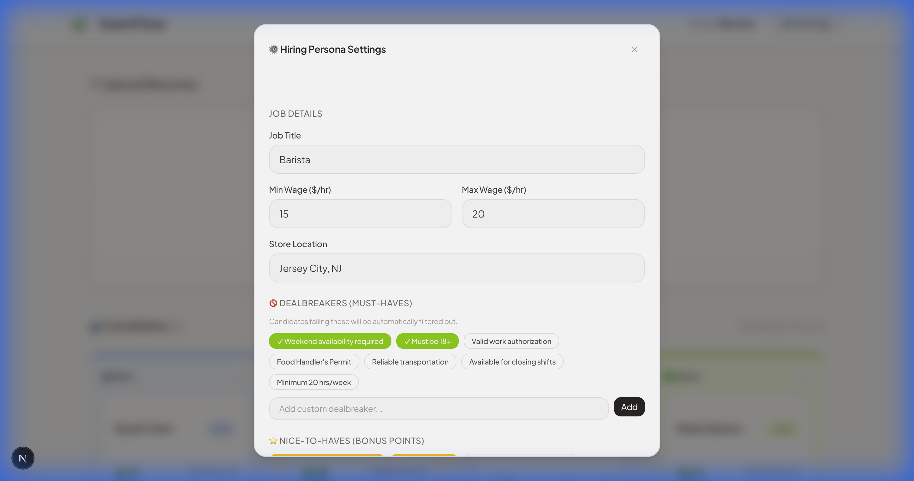
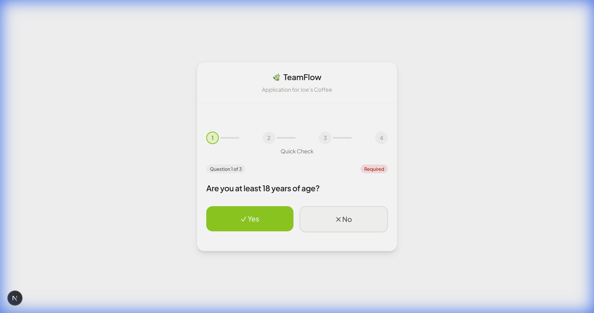
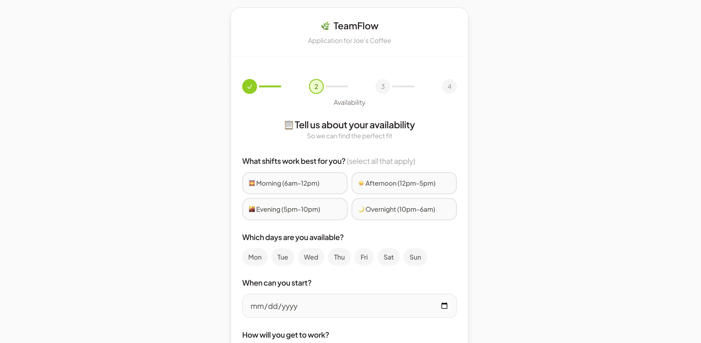
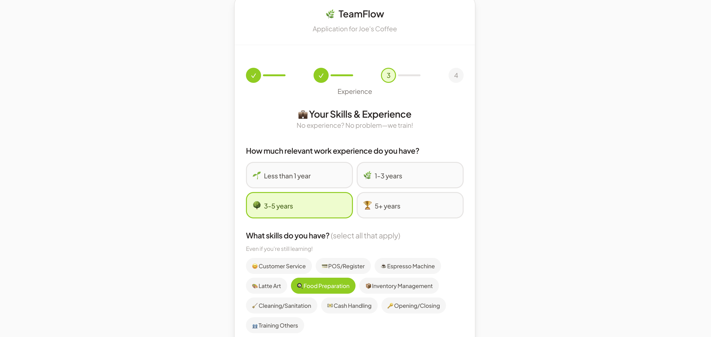

# 🌿 TeamFlow

**AI-Powered Hiring for Hourly Workers**

TeamFlow transforms the hourly hiring process with AI-powered resume parsing, intelligent candidate scoring, and a frictionless application experience. Built for busy hiring managers who need to make fast, informed decisions.

[](https://nextjs.org/)
[](https://ai.google.dev/)
[](https://www.typescriptlang.org/)
[](https://tailwindcss.com/)

---

## 🎯 The Problem

Hiring hourly workers is broken:
- **Managers are buried** in unstructured resumes
- **Candidates drop off** because applications are too long
- **No intelligent filtering** — just gut feelings
- **Manual screening** wastes hours every week

## 💡 The Solution

TeamFlow uses AI to solve this:

| Feature | How It Helps |
|---------|-------------|
| 🧠 **Smart Resume Parsing** | Drop a PDF and get validated structured data plus a fit score |
| 📊 **AI Fit Scoring** | Gemini analyzes each candidate against role-specific requirements |
| 📱 **Magic Link Invite Demo** | Prototype invite and candidate flow; production token verification and route authorization remain open |
| 📋 **Rich Candidate Profiles** | Availability, skills, motivation — all in one place |
| 🎯 **Hiring Personas** | Configure job-related criteria for consistent human review |

---

## 📸 Screenshots

### Manager Experience

#### Dashboard — Kanban Board
Candidates organized by status with AI-generated fit scores. Drag-and-drop to move through the pipeline.



#### Hiring Persona Settings
Define job requirements, dealbreakers, and nice-to-haves. The AI uses this to score every candidate.



---

### Candidate Experience

#### Knockout Questions
Quick yes/no questions clarify job-related eligibility and availability requirements.



#### Availability & Profile
Candidates share their preferred shifts, transportation, and contact preferences.



#### Skills Self-Assessment
Experience level, relevant skills, certifications, and languages — all collected seamlessly.



---

## 🏗️ Architecture

```
┌─────────────────────────────────────────────────────────────┐
│                      NEXT.JS FRONTEND                       │
│  ┌─────────────┐  ┌─────────────┐  ┌─────────────────────┐  │
│  │  Drop Zone  │  │ Kanban Board│  │  Candidate Portal   │  │
│  │ (Resume)    │  │ (Manager)   │  │  (Magic Link)       │  │
│  └──────┬──────┘  └──────┬──────┘  └──────────┬──────────┘  │
└─────────┼────────────────┼───────────────────┼──────────────┘
          │                │                   │
          ▼                ▼                   ▼
┌────────────────────────────┐  ┌──────────────────────────────┐
│ /api/parser                │  │ /api/parser/review           │
│ Extraction + legacy score  │  │ Two-agent review adapter     │
└─────────────┬──────────────┘  └──────────────┬───────────────┘
              ▼                                ▼
┌────────────────────────────┐  ┌──────────────────────────────┐
│ DOCUMENT PROCESSOR         │  │ LANGGRAPH RÉSUMÉ REVIEW      │
│ Cloud Run target/config    │  │ Separate Cloud Run target    │
│ • extraction • embeddings  │  │ • Agent 1 classifications   │
└─────────────┬──────────────┘  │ • deterministic score math  │
              │                 │ • Agent 2 gap questions      │
              │                 │ • read-only private MCP      │
              ▼                 └──────────────┬───────────────┘
┌────────────────────────────┐                 │
│ STRUCTURED SCORER          │                 │
│ • schema validation        │                 │
│ • bounded retry/fallback   │                 │
└─────────────┬──────────────┘                 │
              └───────────────┬────────────────┘
                              ▼
                 ┌────────────────────────────┐
                 │ SUPABASE                   │
                 │ Candidate + optional       │
                 │ review-run persistence     │
                 └────────────────────────────┘
```

### Repository Tour

| Area | Where to Start |
|---|---|
| Manager dashboard | `app/page.tsx` and `components/candidates/` |
| Candidate application | `app/apply/page.tsx` and `components/candidate-application/` |
| API orchestration | `app/api/` |
| AI scoring | `lib/ai/` |
| Supabase access | `lib/db/` and `supabase/` |
| External integrations | `lib/integrations/` |
| Cloud Run service | `services/document-processor/` |
| LangGraph + MCP hiring workflow | `services/hiring-agent/` |
| LLM security and reliability runbook | `docs/llm-security-reliability.md` |
| CI/CD and WIF | `.github/workflows/` |

For the full runtime flow and integration contracts, see [`docs/architecture.md`](docs/architecture.md). For a guided walkthrough, see [`docs/demo-guide.md`](docs/demo-guide.md). Résumé claims and their exact evidence level are tracked in [`docs/resume-claim-evidence.md`](docs/resume-claim-evidence.md).

---

## 🚀 Quick Start

### Prerequisites
- Node.js 22+
- Google AI API Key ([Get one free](https://aistudio.google.com/apikey))
- Supabase Project URL and Anon Key

### Installation

```bash
# Clone the repo
git clone https://github.com/rubiatExe/TeamFlow.git
cd TeamFlow

# Install dependencies
npm install

# Set up environment variables
cp .env.example .env.local
# Add your GOOGLE_API_KEY, NEXT_PUBLIC_SUPABASE_URL, NEXT_PUBLIC_SUPABASE_ANON_KEY, and OCR_SERVICE_URL
# For the unauthenticated local UI demo only, set TEAMFLOW_ENABLE_LEGACY_DEMO_ROUTES=true

# Run the dev server
npm run dev
```

Open [http://localhost:3000](http://localhost:3000) to inspect the local UI. External
services, database bootstrap, and production authorization require the setup described
in the repository docs.

### Test the Candidate Portal
Visit [http://localhost:3000/apply?token=test](http://localhost:3000/apply?token=test) to see the candidate experience.

### Verification

```bash
npm run typecheck
npm run lint
npm test
npm audit --audit-level=high
npm run verify:contracts
npm run build
```

`verify:contracts` checks static WIF, Cloud Run, LangGraph, MCP, OCR, Supabase, and
model-compatibility wiring for accidental source drift. It does not verify live cloud,
database, IAM, provider, or deployment state.

The scorer treats Gemini output as untrusted input: responses must satisfy a
structured-output schema and Zod validation, malformed output receives one
bounded retry, and a conservative deterministic fallback prevents a model
formatting error from failing the upload.

Historical implementation stories, tradeoffs, and lessons learned are captured in
[journal.md](./journal.md). Use the evidence ledger—not the journal alone—for current
interview claims.

For an optional end-to-end local trace that joins Next.js, Cloud Run, OCR,
embedding, scoring, and persistence in Google Cloud Trace, follow
[`ops/observability/README.md`](ops/observability/README.md). Trace export is
disabled by default.

---

## 🛠️ Tech Stack

| Layer | Technology |
|-------|------------|
| **Frontend** | Next.js 16 (App Router), React 19, Tailwind CSS 4 |
| **Microservices** | Python 3, FastAPI, LangGraph, LangChain, and FastMCP, targeting Cloud Run |
| **AI/ML** | Google Gemini for scanned/image transcription, embeddings, and structured analysis |
| **UI Components** | shadcn/ui, Lucide Icons |
| **Database** | Supabase (PostgreSQL) |
| **SMS** | Twilio (for magic links) |
| **Design** | Scandinavian Warmth design system |


---

## 🔮 Roadmap

- [x] Resume parsing with Gemini
- [x] AI fit scoring
- [x] Kanban candidate management
- [x] Supabase integration for candidate persistence
- [x] Deterministic PDF-first extraction with typed, fail-closed provenance
- [x] Synthetic digital/scanned PDF routing and field-survival regression fixtures
- [x] Locally tested Agent 1 → deterministic scoring → Agent 2 LangGraph review API
- [x] Least-privilege two-tool review selection from a shared six-tool FastMCP boundary,
  plus insert-only review contracts
- [x] Versioned shadow-only known-criterion coverage plus explicit integrity/safety gates
- [x] Manifest/hash-bound validation-only risk/coverage tooling (fixture-only; no producer attestation)
- [ ] Human-approved labels, a measured curve, and a separately governed routing threshold
- [x] Feature-gated authenticated v2 human-review backend with PostgreSQL
  checkpoint/restart, tenant-derived queue/detail, and idempotent decisions (locally
  integration-tested; no reviewer UI, claim lease, or deployment evidence)
- [x] Offline diagnostic judge and comparable semantic-regression tooling with
  immutable, content-free artifacts (locally fixture/test-transport tested; no live call)
- [x] Phase 8A repository release hardening: scoped tenant-bound Supabase capabilities,
  killable PDF isolation, hash-locked dependencies, a passing high-severity npm audit
  gate (one moderate `@humanfs/node` advisory remains), fresh migration replay, non-root
  images, and staged exact-digest Cloud Run workflows (locally tested; no live deployment,
  IAM/WAF, provider canary, alert, backup, or rollback evidence)
- [ ] Independent human review of the 30-case validation split and measured live-judge
  agreement, kappa, false-accept, false-reject, and error rates
- [ ] A calibrated narrow judge and separately governed production policy; the diagnostic
  judge currently has no hiring, scoring, routing, persistence, or database authority
- [ ] Live Gemini OCR accuracy, CER/WER, and field-survival quality measurements
- [ ] Production-secure magic link invites (the demo flow is not an authorization boundary)
- [x] Multi-step candidate portal
- [ ] Calendar integration for scheduling
- [ ] Video/audio "Vibe Check" recording
- [ ] Bulk SMS campaigns

---

## 📄 License

MIT © 2024

---
